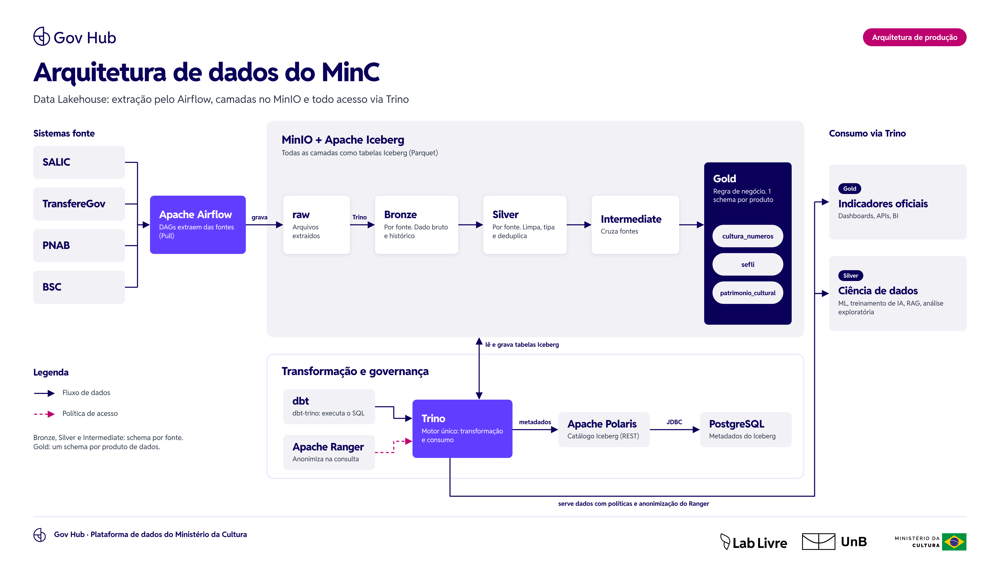
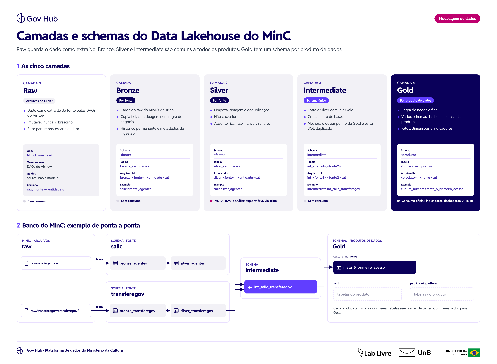

# Gov Hub BR - Transformando Dados em Valor para Gestão Pública

O Gov Hub BR é uma iniciativa para enfrentar os desafios da fragmentação, redundância e inconsistências nos sistemas estruturantes do governo federal. O projeto busca transformar dados públicos em ativos estratégicos, promovendo eficiência administrativa, transparência e melhor tomada de decisão. A partir da integração de dados, gestores públicos terão acesso a informações qualificadas para subsidiar decisões mais assertivas, reduzir custos operacionais e otimizar processos internos. 

Potencializamos informações de sistemas como TransfereGov, Siape, Siafi, ComprasGov e Siorg para gerar diagnósticos estratégicos, indicadores confiáveis e decisões baseadas em evidências.


- Transparência pública e cultura de dados abertos
- Indicadores confiáveis para acompanhamento e monitoramento
- Decisões baseadas em evidências e diagnósticos estratégicos
- Exploração de inteligência artificial para gerar insights
- Gestão orientada a dados em todos os níveis

## Fluxo/Arquitetura de Dados

A arquitetura do Gov Hub BR é baseada na Arquitetura Medallion,  em um fluxo de dados que permite a coleta, transformação e visualização de dados.


Para mais informações sobre o projeto, veja o nosso [e-book](https://github.com/GovHub-br/gov-hub/blob/main/docs/land/dist/ebook/GovHub_Livro-digital_0905.pdf).
E temos também alguns slides falando do projeto e como ele pode ajudar a transformar a gestão pública.

[Slides](https://www.figma.com/slides/PlubQE0gaiBBwFAV5GcVlH/Gov-Hub---F%C3%B3rum-IA---Giga-candanga?node-id=5-131&t=hlLiJiwfyPEPRFys-1)

## Apoio

Esse trabalho  é mantido pelo [Lab Livre](https://www.instagram.com/lab.livre/) e apoiado pelo [IPEA/Dides](https://www.ipea.gov.br/portal/categorias/72-estrutura-organizacional/210-dides-estrutura-organizacional).

## Contato

Para dúvidas, sugestões ou para contribuir com o projeto, entre em contato conosco: [lablivreunb@gmail.com](mailto:lablivreunb@gmail.com)


# Data Application MinC

Este repositório organiza a aplicação de dados em torno do Airflow e do dbt. A
raiz contém o código executado pelo Airflow; a pasta `infra/` concentra Docker,
Compose e arquivos de suporte para o ambiente local.

## Arquitetura de dados

Arquitetura de produção da plataforma de dados do MinC, um Data Lakehouse
aprovado em outubro de 2026. O ambiente local descrito em
[Rodando Localmente](#rodando-localmente) ainda executa o dbt sobre PostgreSQL.



### Componentes

| Componente | Papel |
|---|---|
| **Apache Airflow** | Orquestra a plataforma e faz a extração. As DAGs extraem os dados das fontes (Pull) e gravam os arquivos na zona `raw` do MinIO. CDC é a evolução prevista. |
| **MinIO** | Object storage. Guarda a zona `raw` e os arquivos Parquet de todas as tabelas, da Bronze à Gold. |
| **Apache Iceberg** | Formato de tabela da Bronze, Silver, Intermediate e Gold. Dá transações, snapshots, evolução de schema e time travel sobre os arquivos Parquet. |
| **Apache Polaris** | Catálogo Iceberg (API REST). É o ponto único de leitura e escrita das tabelas. |
| **PostgreSQL** | Persistência do catálogo: guarda só os metadados do Iceberg, que o Polaris acessa via JDBC. Não guarda dados das camadas. |
| **Trino** | Motor único de consulta. Carrega o `raw` na Bronze, executa o SQL do dbt, lê e grava as tabelas Iceberg através do Polaris e serve todo o consumo. |
| **dbt** (`dbt-trino`) | Define as transformações da Bronze à Gold. Consulta os metadados das tabelas, monta o SQL e o executa no Trino. |
| **Apache Ranger** | Políticas de acesso aplicadas no Trino: controle por linha e por coluna, mascaramento, anonimização na consulta e auditoria. |

### Fluxo, passo a passo

1. **Extração.** As DAGs do Airflow extraem os dados das fontes (SALIC,
   TransfereGov, PNAB, BSC) e gravam os arquivos em `raw/`, no MinIO, do jeito
   que chegaram. O `raw` é imutável: nunca é sobrescrito.
2. **Carga na Bronze.** O Trino lê o `raw` e grava a Bronze, uma cópia fiel do
   dado. Não existe etapa de staging entre as duas.
3. **Transformação.** O dbt monta Silver, Intermediate e Gold e executa o SQL
   no Trino. Para saber o que existe, o Trino consulta o Polaris, que lê os
   metadados no PostgreSQL. As tabelas resultantes são gravadas como Iceberg no
   MinIO, ou seja, as transformações acontecem dentro do MinIO.
4. **Consumo.** Todo acesso passa pelo Trino, e o Ranger aplica as políticas e
   a anonimização no momento da consulta. A Gold alimenta os indicadores
   oficiais (dashboards, APIs, BI); a Silver alimenta ML, treinamento de IA,
   RAG e análise exploratória. Ninguém lê arquivos direto do MinIO, porque esse
   caminho escaparia das políticas do Ranger.

### Camadas



| Camada | O que faz | O que não faz | Organização | Consumo |
|---|---|---|---|---|
| **Raw** | Guarda o dado como extraído da fonte. É a base para reprocessar e auditar. | Não é sobrescrita. Não é modelo dbt: entra no projeto como `source`. | Arquivos no MinIO, em `raw/<fonte>/<entidade>/` | Não |
| **Bronze** | Cópia fiel do `raw`, com histórico permanente e metadados de ingestão. | Não tipa, não agrega, não remove registros, não aplica regra de negócio. | Schema da fonte | Não |
| **Silver** | Limpa, tipa, deduplica e normaliza. | Não cruza fontes. Não aplica regra de negócio final. | Schema da fonte | ML, IA, RAG e análise exploratória |
| **Intermediate** | Cruza fontes e concentra transformações reutilizáveis. Melhora o desempenho da Gold e evita SQL duplicado entre produtos. | Não aplica regra de negócio final. | Schema único `intermediate` | Não |
| **Gold** | Regra de negócio final: fatos, dimensões e indicadores. | Não muda de forma incompatível sem versionamento. | Um schema por produto de dados | Consumo oficial |

Bronze, Silver e Intermediate são comuns a todos os produtos de dados; só a
Gold é separada por produto. Em todas as camadas, valor ausente fica nulo e
nunca vira falso.

### Schemas e nomenclatura

A decisão está no [ADR 0010](docs/adr/0010-camadas-e-schemas-do-data-lakehouse.md);
a tabela abaixo é o resumo.

| Camada | Schema | Tabela | Arquivo dbt | Exemplo |
|---|---|---|---|---|
| Raw | — | — | — (`source`) | `raw/salic/agentes/` |
| Bronze | `<fonte>` | `bronze_<entidade>` | `<fonte>/bronze_<entidade>.sql` | `salic.bronze_agentes_agentes` |
| Silver | `<fonte>` | `silver_<entidade>` | `<fonte>/silver_<entidade>.sql` | `salic.silver_agentes_agentes` |
| Intermediate | `intermediate` | `int_<fonte1>_<fonte2>` | `intermediate/int_<fonte1>_<fonte2>.sql` | `intermediate.int_salic_transferegov` |
| Gold | `<produto>` | `<nome>`, sem prefixo | `<produto>/<nome>.sql` | `cultura_em_numeros.eixo2_meta3_fct_pagamento_profissional_rouanet` |

- O nome do arquivo é o nome da tabela. A fonte fica na pasta e no schema,
  não no nome, e não há `alias`.
- A entidade preserva o que identifica a tabela na origem. No SALIC, que tem
  cinco bancos, é `<banco>_<tabela>`: `agentes_agentes`,
  `sac_aberturadecontabancaria`.
- Fonte com uma única entidade usa o nome da fonte como entidade, como em
  `transferegov/bronze_transferegov.sql`.
- A Gold não leva prefixo de camada nem de produto: a pasta e o schema já
  dizem o produto. Dentro da pasta, cada produto nomeia suas tabelas como
  precisar; o Cultura em Números leva eixo e meta no nome.
- Produtos de dados citados até agora: `cultura_em_numeros` (Cultura em
  Números), `sefli` e `patrimonio_cultural`.

Pastas no projeto dbt: uma por fonte, uma por produto e uma `intermediate`,
sem subpasta de camada.

```text
dbt/minc/models/
├── salic/
│   ├── bronze_agentes_agentes.sql
│   └── silver_agentes_agentes.sql
├── bbagil/
│   ├── bronze_controle_extracao_bbagil_extrato.sql
│   └── silver_controle_extracao_bbagil_extrato.sql
├── intermediate/
│   └── int_salic_transferegov.sql
└── cultura_em_numeros/
    └── eixo2_meta3_fct_pagamento_profissional_rouanet.sql
```

Exemplo de ponta a ponta:

```text
raw/salic/agentes/              ─▶ salic.bronze_agentes_agentes     ─▶ salic.silver_agentes_agentes
raw/transferegov/transferegov/  ─▶ transferegov.bronze_transferegov ─▶ transferegov.silver_transferegov

salic.silver_agentes_agentes + transferegov.silver_transferegov
  ─▶ intermediate.int_salic_transferegov
  ─▶ cultura_em_numeros.eixo2_meta5_primeiro_acesso
```

O projeto de hoje ainda está na organização anterior, por domínio; a
migração é incremental e a skill `arquitetura-lakehouse-minc` verifica a
aderência de cada PR.

### Decisões que sustentam a arquitetura

- **Data Lakehouse** com Iceberg sobre MinIO, em vez de data warehouse
  tradicional ou de data lake só de arquivos: escala, versionamento e baixo
  acoplamento, ao custo de mais componentes para operar.
- **Dado bruto imutável**: o `raw` nunca é sobrescrito, o que permite auditar e
  reconstruir qualquer camada.
- **Integração incremental**: começa com Pull pelas DAGs do Airflow e evolui
  para CDC.
- **Catálogo único**: Polaris centraliza leitura e escrita, com os metadados no
  PostgreSQL; o dbt roda pelo Trino, o mesmo motor que serve o consumo.
- **Anonimização na consulta**: os dados ficam íntegros nas camadas e o Ranger
  anonimiza no Trino conforme o perfil de quem consulta. Mantém uma única cópia
  dos dados, e por isso todo acesso precisa passar pelo Trino.
- **Consumo por camada**: a Gold é a camada oficial de consumo; a Silver é
  cedida para ciência de dados.
- **Responsabilidades separadas**: cruzamento entre fontes só na Intermediate,
  regra de negócio só na Gold.

### Em aberto

- Formato dos arquivos gravados em `raw`.
- Estratégia de particionamento das tabelas.
- Lista completa de produtos de dados e como dimensões comuns (tempo,
  território) são compartilhadas entre eles.

## Stack

- **Apache Airflow**: orquestração dos pipelines
- **dbt**: transformação dos dados
- **PostgreSQL**: banco local para desenvolvimento
- **Docker Compose**: execução local dos serviços
- **Make**: automação de comandos de desenvolvimento

## Estrutura

```text
.
├── dags/                 # DAGs carregadas pelo Airflow
│   ├── data_ingest/      # uma pasta por fonte, um arquivo por endpoint
│   └── dbt/              # DAG Cosmos que executa o projeto dbt
├── dbt/minc/             # projeto dbt, fora do parser de DAGs
│   └── models/
│       ├── cotas_dbt/    # Meta 3 — diversidade, cotas e territórios
│       ├── agentes_dbt/  # Meta 5 — perfil e primeiro acesso
│       └── metadata/
├── helpers/              # utilitários importados pelas DAGs
├── plugins/              # clientes de API e extensões usados pelo Airflow
├── infra/                # Docker, compose, Airflow config e init de banco
├── docs-pages/           # site de documentação dos dados, publicado no Pages
├── docs/adr/             # decisões de arquitetura registradas
├── tests/
├── .github/              # formulários de issue, template de PR e workflows
├── .claude/skills/       # skills versionadas — chegam a quem clona
├── CLAUDE.md             # mapa do repositório e convenções
├── Makefile
├── pyproject.toml
└── requirements.txt
```

Como o trabalho flui aqui — issue por formulário, branch a partir da label,
template de PR — está em [`.github/GUIA.md`](.github/GUIA.md). As skills
disponíveis, em [`.claude/skills/GUIA.md`](.claude/skills/GUIA.md). O mapa
detalhado das pastas e as convenções de branch e commit, em
[`CLAUDE.md`](CLAUDE.md).

## Documentação dos dados

O que cada conjunto de dados significa, de onde vem e o que é preciso saber antes
de citar seus números fica no site em [`docs-pages/`](docs-pages/), com uma visão
por público — quem decide, quem constrói e quem chega agora.

```bash
make docs-serve      # constrói e serve em localhost:8000
```

O site lê os fatos do repositório a cada coleta; só a narrativa é escrita à mão.
Ver [`docs-pages/GUIA.md`](docs-pages/GUIA.md).

## Setup

```bash
make setup
```

Para usar Docker Compose, mantenha um `.env` na raiz do projeto. Um exemplo de
variáveis esperadas está em `infra/env/.env.example`.

## Rodando Localmente

```bash
make up
```

Serviços principais:

- Airflow: http://localhost:8080
- Airflow MCP: http://localhost:8000
- PostgreSQL: localhost:5432

Comandos úteis:

```bash
make compose-config
make logs-airflow
make down
```

## Desenvolvimento

```bash
make format
make lint
make test
```

## Git Workflow

This project requires signed commits. To set up GPG signing:

1. Generate a GPG key:
```bash
gpg --full-generate-key
```

2. Configure Git to use GPG signing:
```bash
git config --global user.signingkey YOUR_KEY_ID
git config --global commit.gpgsign true
```

3. Add your GPG key to your GitLab account

## Documentation

- [Airflow Documentation](https://airflow.apache.org/docs/)
- [dbt Documentation](https://docs.getdbt.com/)

## Contributing

1. Create a new branch for your feature
2. Make changes and ensure all tests pass
3. Submit a merge request
